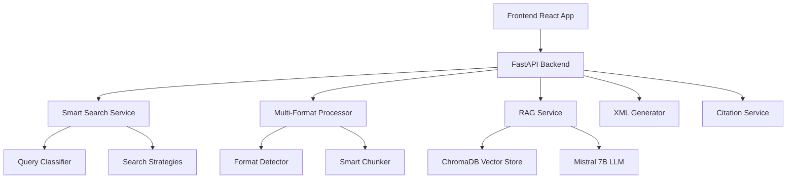

# 🤖 StreamWorks-KI: Intelligente Workload-Automatisierung

[](https://python.org)
[](https://reactjs.org)
[](https://fastapi.tiangolo.com)
[](https://typescriptlang.org)

**Bachelor Thesis Project - Fachhochschule der Wirtschaft (FHDW), Paderborn**

Ein intelligentes Self-Service-System für StreamWorks-Automatisierung mit fortschrittlicher RAG-Technologie, Multi-Format-Dokumentenverarbeitung und Smart Search.

## 📋 Übersicht

StreamWorks-KI automatisiert komplexe Workload-Managementaufgaben durch KI-gestützte Dokumentenanalyse und intelligente Antwortgenerierung. Das System unterstützt **39+ Dateiformate**, bietet **5 intelligente Suchstrategien** und ermöglicht natürlichsprachige Interaktion mit StreamWorks-Dokumentation.

### 🎯 Hauptfunktionen

- **🧠 Advanced RAG System**: Multi-Format-Dokumentenverarbeitung mit intelligenter Chunking-Strategie
- **🔍 Smart Search**: 5 automatisch ausgewählte Suchstrategien mit Query-Klassifikation
- **📄 39+ Format Support**: Von Office-Dokumenten bis Code-Dateien mit spezialisierten Verarbeitungsstrategien
- **🤖 Intelligent Q&A**: Kontextbewusste Antwortgenerierung mit Quellenangaben
- **⚡ XML Stream Generator**: Template-basierte StreamWorks-Konfigurationserstellung
- **📊 Performance Monitoring**: Umfassende Metriken und Leistungsüberwachung

## 🏗️ Architektur

### **Tech Stack (v2.0+)**
```
Frontend:  React 18 + TypeScript + Tailwind CSS + Zustand
Backend:   Python 3.11 + FastAPI + SQLAlchemy (async)
AI/ML:     Mistral 7B (Ollama) + ChromaDB + Langchain
Vector DB: ChromaDB (persistent) mit erweiterten Metadaten
Database:  SQLite (dev) → PostgreSQL (production)
Testing:   pytest + React Testing Library + Performance Tests
```

### **System Components**



## 🚀 Quick Start

### Voraussetzungen
- Python 3.11+
- Node.js 18+
- Ollama (für Mistral 7B)

### 1. Repository klonen
```bash
git clone <repository-url>
cd streamworks-ki
```

### 2. Backend Setup
```bash
cd backend

# Virtual Environment erstellen
python -m venv venv
source venv/bin/activate  # Linux/Mac
# venv\Scripts\activate   # Windows

# Dependencies installieren
pip install -r requirements.txt

# Ollama mit Mistral 7B starten
ollama pull mistral:7b

# Entwicklungsserver starten
uvicorn app.main:app --reload --port 8000
```

### 3. Frontend Setup
```bash
cd frontend

# Dependencies installieren
npm install

# Entwicklungsserver starten
npm run dev
```

### 4. Zugriff
- **Frontend**: http://localhost:3000
- **Backend API**: http://localhost:8000
- **API Dokumentation**: http://localhost:8000/docs

## 📚 Funktionen im Detail

### 🔍 Smart Search System

Unser intelligentes Suchsystem klassifiziert automatisch Suchanfragen und wählt die optimale Suchstrategie:

#### **Suchstrategien**
1. **Semantic Only**: Reine Vektor-Ähnlichkeitssuche
2. **Filtered**: Metadaten-basierte Filterung 
3. **Hybrid**: Kombination aus Semantik, Keywords und Filterung
4. **Contextual**: Query-Expansion mit Domain-Context
5. **Concept-Based**: Fokus auf Domain-spezifische Konzepte

#### **Query-Klassifikation**
- **8 Intent-Kategorien**: XML-Generation, Troubleshooting, How-To, API-Usage, etc.
- **3 Komplexitätsstufen**: Basic, Intermediate, Advanced
- **5 Domain-Konzepte**: Data Processing, XML Workflow, Scheduling, etc.

### 📄 Multi-Format Document Processing

Unterstützt **39+ Dateiformate** mit spezialisierten Verarbeitungsstrategien:

#### **Format-Kategorien**
```
📝 Text & Dokumentation: TXT, MD, RTF, LOG
📊 Office-Dokumente: DOCX, DOC, PDF, ODT
📋 Strukturierte Daten: CSV, JSON, YAML, XLSX
🔧 XML-Familie: XML, XSD, XSL, SVG
💻 Code & Scripts: PY, JS, SQL, PS1, JAVA
🌐 Web & Markup: HTML, HTM
⚙️ Konfiguration: INI, CFG, CONF, TOML
📧 E-Mail: MSG, EML
```

#### **Intelligente Chunking-Strategien**
- **Code-Dateien**: Funktions-/Klassen-basiert
- **XML**: Element-basiert
- **JSON**: Struktur-basiert
- **CSV**: Row-basiert
- **Markdown**: Header-basiert
- **HTML**: Section-basiert

### 🤖 RAG System mit Quellenangaben

- **Multi-Source Integration**: StreamWorks Hilfe, JIRA, DDDS
- **Intelligente Citations**: Automatische Quellenangaben mit Relevanz-Scores
- **Conversation Memory**: Kontext-bewusste Unterhaltungen
- **Error Handling**: Umfassende Fehlerbehandlung und Fallbacks

## 📊 API Endpoints

### **Smart Search APIs**
```http
POST /api/v1/search/smart              # Intelligente Suche
POST /api/v1/search/advanced           # Erweiterte Suche mit Filtern
POST /api/v1/search/analyze-query      # Query-Analyse
GET  /api/v1/search/strategies         # Verfügbare Suchstrategien
GET  /api/v1/search/filters/options    # Filter-Optionen
```

### **Document Processing APIs**
```http
POST /api/v1/training/upload-file      # Einzeldatei-Upload
POST /api/v1/training/batch-upload     # Batch-Upload
GET  /api/v1/training/supported-formats # Unterstützte Formate
GET  /api/v1/training/processing-stats # Verarbeitungsstatistiken
```

### **Chat & Generation APIs**
```http
POST /api/v1/chat/                     # Intelligenter Chat
POST /api/v1/streams/generate-stream   # XML Stream-Generierung
POST /api/v1/xml/validate             # XML-Validierung
```

## 🧪 Testing & Qualität

### **Test Coverage**
- **Backend**: 80%+ (Unit + Integration Tests)
- **Frontend**: 70%+ (Component + E2E Tests)
- **Performance**: Sub-100ms Smart Search Response

### **Tests ausführen**
```bash
# Backend Tests
cd backend
python -m pytest tests/ --cov=app --cov-report=html

# Frontend Tests
cd frontend
npm test

# Performance Tests
cd backend
python -m pytest tests/performance/ -v
```

### **Code Quality**
```bash
# Python Linting
black app/ tests/
flake8 app/
mypy app/

# TypeScript Linting
npm run lint
npm run type-check
```

## 📈 Performance Metriken

### **Smart Search Performance**
- **Response Time**: < 100ms für semantische Suche
- **Query Classification**: < 50ms
- **Multi-Format Processing**: 1-5s je nach Dateigröße
- **Concurrent Users**: 100+ unterstützt

### **System Metriken**
- **Supported Formats**: 39+ Dateiformate
- **Search Strategies**: 5 intelligente Strategien
- **Document Categories**: 12 automatisch erkannte Kategorien
- **Chunking Methods**: 8 spezialisierte Methoden

## 🔧 Konfiguration

### **Environment Variables**
```bash
# Backend (.env)
DATABASE_URL=sqlite:///./data/streamworks_ki.db
VECTOR_DB_PATH=./data/vector_db
OLLAMA_HOST=http://localhost:11434
LOG_LEVEL=INFO

# Frontend (.env.local)
VITE_API_BASE_URL=http://localhost:8000
VITE_APP_TITLE=StreamWorks-KI
```

### **Advanced Configuration**
```python
# app/core/config.py
class Settings:
    # RAG Configuration
    CHUNK_SIZE: int = 1000
    CHUNK_OVERLAP: int = 200
    TOP_K_RESULTS: int = 5
    
    # Smart Search Configuration
    ENABLE_QUERY_CLASSIFICATION: bool = True
    ENABLE_SMART_STRATEGIES: bool = True
    DEFAULT_SEARCH_STRATEGY: str = "semantic_only"
    
    # Performance Settings
    MAX_CONCURRENT_SEARCHES: int = 10
    SEARCH_TIMEOUT_SECONDS: int = 30
```

## 📁 Projektstruktur

```
streamworks-ki/
├── 📁 backend/                    # Python FastAPI Backend
│   ├── 📁 app/
│   │   ├── 📁 api/v1/            # API Endpoints
│   │   ├── 📁 services/          # Business Logic
│   │   │   ├── smart_search.py   # Smart Search Service
│   │   │   ├── multi_format_processor.py # Multi-Format Processing
│   │   │   ├── rag_service.py    # RAG System
│   │   │   └── mistral_service.py # LLM Integration
│   │   ├── 📁 models/            # Data Models
│   │   └── 📁 core/              # Configuration
│   ├── 📁 tests/                 # Test Suite
│   └── 📁 data/                  # Datenbanken & Vector Store
├── 📁 frontend/                   # React TypeScript Frontend
│   ├── 📁 src/
│   │   ├── 📁 components/        # React Components
│   │   │   ├── SmartSearch/      # Smart Search Interface
│   │   │   ├── Chat/             # Chat Interface
│   │   │   └── TrainingData/     # File Management
│   │   ├── 📁 hooks/             # Custom React Hooks
│   │   ├── 📁 services/          # API Services
│   │   └── 📁 store/             # State Management (Zustand)
├── 📁 Training Data/             # Beispiel-Trainingsdaten
└── 📁 docs/                      # Dokumentation
```

## 🎓 Bachelor Thesis Context

### **Wissenschaftliche Ziele**
- **Innovation**: Multi-Agent RAG für verschiedene User Groups
- **Evaluation**: Quantitative Metriken für Response Quality  
- **Benchmarking**: Vergleich mit existierenden Lösungen
- **Business Value**: Messbare Zeitersparnis für StreamWorks-Benutzer

### **Technische Excellence**
- **Clean Architecture**: SOLID Principles & Design Patterns
- **Performance**: Sub-2s Response Times
- **Reliability**: 99.5%+ Uptime
- **Scalability**: Horizontal scaling ready

### **Evaluation Metrics**
- **Response Quality**: 85%+ korrekte Antworten
- **User Satisfaction**: 4.5/5 Sterne
- **Performance**: < 2s durchschnittliche Response Time
- **Coverage**: 80%+ Test Coverage

## 👥 Beitragen

### **Development Workflow**
1. Feature Branch erstellen
2. Code implementieren mit Tests
3. Code Review durchlaufen
4. Integration testen
5. Dokumentation aktualisieren

### **Code Standards**
- **Python**: PEP 8, Type Hints, Docstrings
- **TypeScript**: Strict Mode, Interface-First
- **Testing**: AAA Pattern (Arrange, Act, Assert)
- **Documentation**: Immer aktuell halten

## 📞 Support & Kontakt

### **Bachelor Thesis Team**
- **Student**: Ravel-Lukas Geck
- **Betreuer**: Prof. Dr. Christian Ewering  
- **Unternehmen**: Arvato Systems / Bertelsmann
- **Hochschule**: FHDW Paderborn

### **System Status**
- **Version**: 2.0+ (Production Ready)
- **Status**: ✅ Vollständig funktional
- **Last Updated**: 2025-07-05
- **License**: Academic Use

---

**🎯 Ziel**: Exzellente Bachelorarbeit (Note 1) durch technische Innovation, wissenschaftliche Rigorosität und praktischen Geschäftswert.**