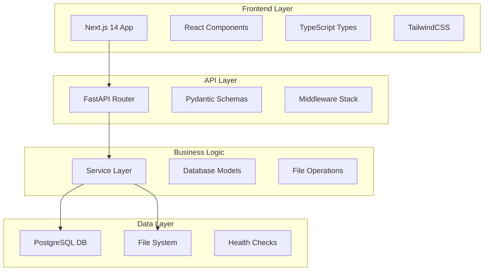

# 🏗️ Technical Architecture

> **Detailed system architecture, design patterns, and technical decisions for StreamWorks Document Management System**

---

## 🎯 **Architecture Overview**

StreamWorks follows a **modern three-tier architecture** with clear separation of concerns:



---

## 🗄️ **Database Design**

### **Entity Relationship Model**

```sql
-- Core entities with hierarchical structure
┌─────────────┐    ┌─────────────┐
│   folders   │    │ documents   │
├─────────────┤    ├─────────────┤
│ id (PK)     │    │ id (PK)     │
│ name        │◄──┤ folder_id   │
│ parent_id   │    │ filename    │
│ description │    │ original_name│
│ created_at  │    │ file_path   │
│ updated_at  │    │ file_size   │
└─────────────┘    │ mime_type   │
       ▲           │ created_at  │
       │           │ updated_at  │
       │           └─────────────┘
       │                    
   Self-Reference           
   for Hierarchy            
```

### **Database Features**

- **Hierarchical Folders**: Self-referencing `parent_id` for unlimited nesting
- **Referential Integrity**: Foreign keys with CASCADE deletes
- **Indexing Strategy**: Optimized queries on `folder_id`, `parent_id`  
- **Timestamps**: Automatic `created_at`/`updated_at` tracking
- **Data Types**: UUID primary keys, VARCHAR constraints, BIGINT for file sizes

---

## 🔧 **Backend Architecture**

### **FastAPI Application Structure**

```python
# Application Lifecycle
@asynccontextmanager
async def lifespan(app: FastAPI):
    # Startup: Initialize database connections
    await init_database()
    await create_default_folder_if_needed()
    yield
    # Shutdown: Clean up resources  
    await close_database()

# Core FastAPI App
app = FastAPI(
    title="StreamWorks Document Management",
    version="2.0.0",
    lifespan=lifespan,
    docs_url="/docs"
)
```

### **Layered Architecture Pattern**

```
┌─────────────────┐
│   Routers       │  ← HTTP endpoint definitions
│   (folders.py)  │    (request/response handling)
├─────────────────┤
│   Schemas       │  ← Pydantic models for validation
│   (core.py)     │    (request/response serialization)
├─────────────────┤  
│   Services      │  ← Business logic implementation
│   (folder_svc)  │    (core application functionality)
├─────────────────┤
│   Models        │  ← SQLAlchemy database models  
│   (core.py)     │    (ORM entity definitions)
├─────────────────┤
│   Database      │  ← Connection management
│   (database.py) │    (session handling, health checks)
└─────────────────┘
```

### **Key Design Patterns**

1. **Dependency Injection**: Database sessions injected via FastAPI's dependency system
2. **Repository Pattern**: Service layer abstracts database operations
3. **Single Responsibility**: Each module has one clear purpose  
4. **Error Boundaries**: Comprehensive exception handling at each layer
5. **Async/Await**: Non-blocking I/O throughout the stack

---

## 🎨 **Frontend Architecture**

### **Next.js 14 App Router Structure**

```
frontend/src/
├── app/                    # App Router (Next.js 14)
│   ├── layout.tsx         # Root layout with providers
│   ├── page.tsx           # Home page (/)
│   ├── dashboard/         # Dashboard feature (/dashboard)
│   ├── upload/            # File upload (/upload)  
│   └── providers.tsx      # React Query + Theme providers
├── components/            # Reusable UI components
│   ├── ui/               # Base UI components (buttons, cards)
│   ├── documents/        # Document-specific components  
│   ├── folders/          # Folder management components
│   └── layout/           # Layout components (nav, sidebar)
├── services/             # API client functions
│   ├── api.ts           # Base API configuration
│   ├── document.service.ts # Document operations
│   └── folder.service.ts   # Folder operations  
├── types/                # TypeScript type definitions
│   ├── document.types.ts # Document-related types
│   └── folder.types.ts   # Folder-related types
└── utils/                # Utility functions
    ├── formatting.ts     # Date/size formatting
    └── validation.ts     # Form validation helpers
```

### **Component Architecture**

```typescript
// Smart Components (Data Fetching)
const DocumentManager = () => {
  const { data: documents } = useDocuments();
  const { data: folders } = useFolders();
  
  return (
    <DocumentList documents={documents} />
    <FolderTree folders={folders} />
  );
};

// Dumb Components (Pure UI)  
const DocumentList = ({ documents }) => (
  <div className="grid gap-4">
    {documents.map(doc => (
      <DocumentCard key={doc.id} document={doc} />
    ))}
  </div>
);
```

### **State Management Strategy**

- **Server State**: React Query for API data caching and synchronization
- **UI State**: React's built-in `useState` and `useReducer`
- **Form State**: Controlled components with validation
- **Global State**: React Context for theme and authentication

---

## 🔐 **Security Architecture**  

### **Backend Security**

```python
# CORS Configuration
app.add_middleware(
    CORSMiddleware,
    allow_origins=["http://localhost:3000"],  # Configurable for production
    allow_credentials=True,
    allow_methods=["*"],
    allow_headers=["*"],
)

# Request Validation
class DocumentCreate(BaseModel):
    filename: str = Field(..., min_length=1, max_length=255)
    folder_id: Optional[int] = Field(None, ge=1)
    
# File Upload Security
ALLOWED_EXTENSIONS = {'.pdf', '.docx', '.txt', '.jpg', '.png'}
MAX_FILE_SIZE = 100 * 1024 * 1024  # 100MB
```

### **Security Features**

- **Input Validation**: Pydantic models validate all request data
- **File Type Restrictions**: Configurable allowed file extensions  
- **Size Limits**: Prevent large file attacks
- **SQL Injection Prevention**: SQLAlchemy ORM with parameterized queries
- **Path Traversal Protection**: Secure file path handling
- **Error Information Leakage**: Generic error messages in production

---

## 📊 **Performance Architecture**

### **Backend Performance**

```python
# Async Database Operations  
async with AsyncSessionLocal() as db:
    result = await db.execute(select(Document).where(...))
    
# Streaming File Responses
return StreamingResponse(
    io.BytesIO(file_content), 
    media_type=mime_type,
    headers={"Content-Disposition": f"attachment; filename={filename}"}
)

# Connection Pooling
engine = create_async_engine(
    DATABASE_URL,
    pool_size=10,           # Base connections
    max_overflow=20,        # Additional connections  
    pool_pre_ping=True,     # Validate connections
    pool_recycle=1800       # Recycle every 30 minutes
)
```

### **Frontend Performance**

```typescript
// Code Splitting
const DocumentViewer = dynamic(() => import('./DocumentViewer'), {
  loading: () => <Spinner />,
  ssr: false
});

// Data Caching
const useDocuments = () => useQuery({
  queryKey: ['documents'],
  queryFn: documentService.getAll,
  staleTime: 5 * 60 * 1000, // 5 minutes
  cacheTime: 10 * 60 * 1000  // 10 minutes
});

// Optimistic Updates
const deleteDocument = useMutation({
  mutationFn: documentService.delete,
  onMutate: async (documentId) => {
    // Cancel outgoing refetches
    await queryClient.cancelQueries(['documents']);
    // Snapshot previous value  
    const previous = queryClient.getQueryData(['documents']);
    // Optimistically update
    queryClient.setQueryData(['documents'], old => 
      old?.filter(doc => doc.id !== documentId)
    );
    return { previous };
  },
  onError: (err, variables, context) => {
    // Rollback on error
    queryClient.setQueryData(['documents'], context.previous);
  }
});
```

---

## 🔄 **Data Flow Architecture**

### **Request/Response Flow**

```
1. User Action (Frontend)
   ↓
2. API Call (TypeScript Service)  
   ↓
3. HTTP Request (Fetch/Axios)
   ↓
4. FastAPI Router (Python)
   ↓  
5. Pydantic Validation (Schema)
   ↓
6. Service Layer (Business Logic)
   ↓
7. SQLAlchemy ORM (Database)
   ↓
8. PostgreSQL Query (Data Layer)
   ↓
9. Response Serialization (Pydantic) 
   ↓
10. JSON Response (HTTP)
    ↓
11. React Query Cache (Frontend)
    ↓
12. UI Update (React State)
```

### **File Upload Flow**

```
1. File Selection (React Dropzone)
   ↓
2. Client-side Validation (Size/Type)
   ↓  
3. FormData Creation (Multipart)
   ↓
4. Upload Progress (Streaming)
   ↓
5. Server Validation (FastAPI)
   ↓
6. File System Write (Async I/O)
   ↓
7. Database Record (Metadata)
   ↓
8. Success Response (File Info)
   ↓
9. UI Update (Document List)
```

---

## 🏥 **Health & Monitoring**

### **Health Check Architecture**

```python
# Multi-level Health Checks
@app.get("/health")  
async def basic_health():
    return {"status": "healthy"}

@app.get("/health/database")
async def database_health():
    try:
        async with AsyncSessionLocal() as db:
            await db.execute(text("SELECT 1"))
        return {"status": "healthy", "database": "connected"}
    except Exception:
        return {"status": "unhealthy", "database": "disconnected"}

@app.get("/health/detailed")  
async def detailed_health():
    return {
        "status": "healthy",
        "components": {
            "database": await check_database(),
            "storage": check_file_system(),
            "memory": get_memory_usage()
        },
        "version": "2.0.0",
        "uptime": get_uptime()
    }
```

### **Monitoring Strategy**

- **Application Logs**: Structured logging with correlation IDs
- **Performance Metrics**: Response times, throughput, error rates
- **Resource Monitoring**: CPU, memory, disk usage
- **Database Metrics**: Connection pool, query performance
- **Business Metrics**: Document counts, user activity

---

## 🚀 **Deployment Architecture**

### **Development Environment**
```yaml
services:
  backend:
    build: ./backend
    ports: ["8000:8000"]
    environment:
      DATABASE_URL: postgresql://postgres:password@db:5432/streamworks
    depends_on: [db]
    
  frontend:  
    build: ./frontend
    ports: ["3000:3000"]
    environment:
      NEXT_PUBLIC_API_URL: http://localhost:8000
    depends_on: [backend]
    
  db:
    image: postgres:15
    environment:
      POSTGRES_DB: streamworks
      POSTGRES_USER: postgres  
      POSTGRES_PASSWORD: password
    volumes:
      - postgres_data:/var/lib/postgresql/data
```

### **Production Considerations**

- **Container Orchestration**: Kubernetes or Docker Swarm
- **Load Balancing**: NGINX or cloud load balancers  
- **Database**: Managed PostgreSQL (AWS RDS, GCP Cloud SQL)
- **File Storage**: Cloud storage (S3, GCS) with CDN
- **Monitoring**: Prometheus + Grafana stack
- **Logging**: ELK stack or cloud logging services

---

## 📚 **Design Decisions & Trade-offs**

### **Technology Choices**

| Decision | Rationale | Trade-offs |
|----------|-----------|------------|
| **FastAPI** | Modern async framework, automatic docs, type safety | Learning curve vs Flask |
| **Next.js 14** | App Router, SSR/SSG, TypeScript support | Complexity vs Create React App |
| **PostgreSQL** | ACID compliance, JSON support, scalability | Setup vs SQLite |
| **File System** | Simple deployment, no external dependencies | Scalability vs cloud storage |
| **React Query** | Server state caching, optimistic updates | Bundle size vs native fetch |

### **Architectural Principles**

1. **Separation of Concerns**: Clear layer boundaries
2. **Single Source of Truth**: Database as primary data source
3. **Fail Fast**: Early validation and error handling
4. **Graceful Degradation**: System works with reduced functionality
5. **Scalability Ready**: Stateless design, database-driven

---

**Architecture designed for maintainability, scalability, and developer experience** 🏗️