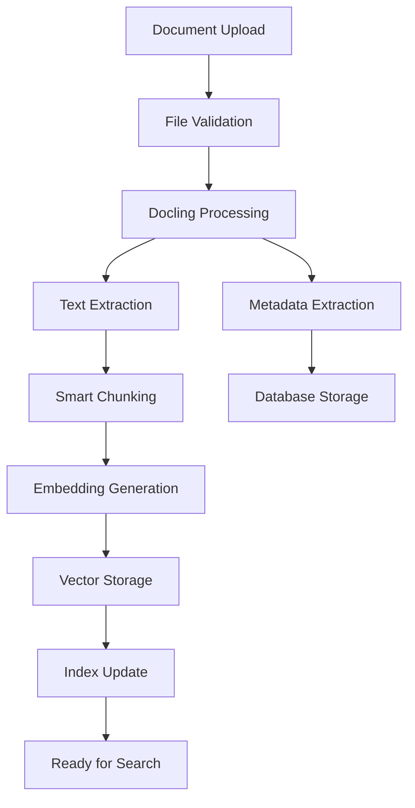

# 🏗️ System Architecture

> **Detaillierte Architektur-Dokumentation des Streamworks-KI RAG Systems**  
> Enterprise-grade Design für skalierbare Dokumentenverarbeitung

---

## 🎯 **Architektur-Übersicht**

Streamworks-KI implementiert eine **moderne Mikroservice-Architektur** mit klarer Trennung zwischen Frontend, Backend und Datenebene:

```
┌─────────────────────────────────────────────────────────────────┐
│                        Frontend Layer                           │
├─────────────────────────────────────────────────────────────────┤
│  Next.js 14 App Router │ TypeScript │ TailwindCSS │ 66 Components│
│  React Query │ Zustand │ Framer Motion │ Real-time WebSockets    │
└─────────────────┬───────────────────────────────────────────────┘
                  │ HTTP/WebSocket APIs
┌─────────────────▼───────────────────────────────────────────────┐
│                      API Gateway Layer                          │
├─────────────────────────────────────────────────────────────────┤
│           FastAPI 0.115.4 │ Async/Await │ Pydantic             │
│           CORS │ Rate Limiting │ Authentication Ready           │
└─────────────────┬───────────────────────────────────────────────┘
                  │ Internal Service Communication
┌─────────────────▼───────────────────────────────────────────────┐
│                    Service Layer (16+ Services)                 │
├─────────────────────────────────────────────────────────────────┤
│ DocumentService │ ChatService │ EmbeddingService │ RAGService   │
│ FolderService │ VectorStore │ DoclingIngest │ WebSocketManager  │
│ CacheService │ RerankerService │ UploadJobManager │ ...        │
└─────────────────┬───────────────────────────────────────────────┘
                  │ Data Access Layer
┌─────────────────▼───────────────────────────────────────────────┐
│                      Data & Storage Layer                       │
├─────────────────────────────────────────────────────────────────┤
│ PostgreSQL │ ChromaDB │ Local Storage │ Redis (planned) │      │
│ Supabase │ Vector Embeddings │ Document Files │ Cache Store    │
└─────────────────────────────────────────────────────────────────┘
```

---

## 🏛️ **System Components**

### **1. Frontend Architecture (Next.js 14)**

#### **App Router Structure**
```
frontend/src/
├── app/                    # Next.js App Router
│   ├── layout.tsx         # Root Layout
│   ├── page.tsx           # Landing Page  
│   ├── chat/              # Chat Interface
│   ├── documents/         # Document Management
│   ├── dashboard/         # System Monitoring
│   └── providers.tsx     # Global Providers
│
├── components/            # 66+ React Components
│   ├── chat/             # Chat System (8 Components)
│   │   ├── ChatInterface.tsx
│   │   ├── EnterpriseInputArea.tsx
│   │   ├── MessageActions.tsx
│   │   └── SourcePreviewModal.tsx
│   ├── documents/        # Document Management
│   ├── dashboard/        # Monitoring Dashboard
│   ├── layout/           # Layout Components
│   └── ui/               # Reusable UI Components
│
├── services/             # API Client Layer
│   ├── localChatApiService.ts
│   ├── documentApiService.ts
│   └── websocketService.ts
│
└── hooks/                # Custom React Hooks
    ├── useChatStorage.ts
    ├── useDocuments.ts
    └── useWebSocket.ts
```

#### **State Management Architecture**
```typescript
// Global State: React Query + Zustand
interface AppState {
  // Server State (React Query)
  documents: UseQueryResult<Document[]>
  folders: UseQueryResult<Folder[]>  
  chatSessions: UseQueryResult<ChatSession[]>
  
  // Client State (Zustand)
  ui: {
    theme: 'light' | 'dark' | 'system'
    sidebarOpen: boolean
    activeView: string
  }
  
  // Real-time State (WebSocket)
  uploadProgress: Map<string, UploadProgress>
  liveUpdates: RealtimeUpdate[]
}
```

### **2. Backend Architecture (FastAPI)**

#### **Service Layer Design**
```python
# 16+ Specialized Services
backend/services/
├── chat_service.py           # Chat Session Management
├── document_service.py       # Document CRUD Operations
├── folder_service.py         # Hierarchical Folder Management
├── docling_ingest.py         # Layout-aware Document Processing
├── embeddings.py             # Embedding Generation Service
├── vectorstore.py            # ChromaDB Vector Operations
├── unified_rag_service.py    # RAG Pipeline Orchestration
├── local_rag_service.py      # Local AI Model Integration
├── ollama_service.py         # Ollama Model Interface
├── web_agent_service.py      # Web Search Integration
├── reranker.py               # Result Reranking Service
├── enterprise_cache.py      # Multi-level Caching System
├── upload_job_manager.py     # Async Upload Processing
├── websocket_manager.py      # Real-time Communication
├── performance_monitor.py    # System Performance Tracking
└── qa_pipeline.py            # Question-Answering Pipeline
```

#### **Router Architecture**
```python
# API Endpoint Organization
backend/routers/
├── folders.py              # Folder Management API
├── documents.py            # Document Operations API  
├── chat.py                 # Chat & RAG API
├── websockets.py           # Real-time WebSocket API
└── upload_progress_websocket.py  # Upload Progress API
```

#### **Data Models**
```python
# SQLAlchemy Models
backend/models/core.py

class Folder(Base):
    id: UUID
    name: str
    description: str
    parent_id: Optional[UUID]  # Hierarchical Structure
    created_at: datetime
    updated_at: datetime
    
    # Relationships
    children: List["Folder"]
    documents: List["Document"]

class Document(Base):
    id: UUID
    filename: str
    original_name: str
    folder_id: UUID
    file_path: str
    file_size: int
    mime_type: str
    status: DocumentStatus  # uploaded, processing, processed, failed
    processing_metadata: JSON
    created_at: datetime
    processed_at: Optional[datetime]
    
    # Relationships  
    folder: Folder
    chunks: List["DocumentChunk"]

class DocumentChunk(Base):
    id: UUID
    document_id: UUID
    content: str
    chunk_index: int
    page_number: Optional[int]
    metadata: JSON
    embedding_vector: Optional[bytes]  # Stored embeddings
```

---

## 🔄 **RAG Pipeline Architecture**

### **Document Processing Flow**


#### **1. Docling Integration**
```python
class DoclingIngestService:
    """Layout-aware document processing with structure preservation"""
    
    async def process_document(self, file_path: str) -> ProcessingResult:
        # Use Docling for layout-aware parsing
        doc = DoclingDocument.from_file(file_path)
        
        # Extract structured content
        tables = self._extract_tables(doc)
        images = self._extract_images(doc)  
        text_blocks = self._extract_text_blocks(doc)
        metadata = self._extract_metadata(doc)
        
        # Create context-aware chunks
        chunks = self._create_smart_chunks(
            text_blocks, 
            preserve_structure=True,
            include_context=True
        )
        
        return ProcessingResult(
            chunks=chunks,
            tables=tables,
            images=images,
            metadata=metadata
        )
```

#### **2. Embedding Pipeline**
```python
class EmbeddingService:
    """Multi-model embedding generation with caching"""
    
    def __init__(self):
        self.models = {
            'default': SentenceTransformer('all-MiniLM-L6-v2'),
            'multilingual': SentenceTransformer('paraphrase-multilingual-MiniLM-L12-v2'),
            'large': SentenceTransformer('all-mpnet-base-v2')
        }
        
    async def generate_embeddings(
        self, 
        texts: List[str], 
        model_name: str = 'default'
    ) -> List[np.ndarray]:
        # Batch processing for efficiency
        embeddings = await self._batch_encode(texts, model_name)
        
        # Cache embeddings for reuse
        await self._cache_embeddings(texts, embeddings)
        
        return embeddings
```

#### **3. Vector Search & Retrieval**
```python
class VectorStoreService:
    """ChromaDB interface with advanced search capabilities"""
    
    async def similarity_search(
        self,
        query: str,
        k: int = 5,
        filter_metadata: Optional[Dict] = None,
        similarity_threshold: float = 0.7
    ) -> List[SearchResult]:
        # Generate query embedding
        query_embedding = await self.embedding_service.embed_query(query)
        
        # Perform vector search with metadata filtering
        results = self.chroma_collection.query(
            query_embeddings=[query_embedding],
            n_results=k * 2,  # Over-retrieve for reranking
            where=filter_metadata,
            include=['documents', 'metadatas', 'distances']
        )
        
        # Apply similarity threshold
        filtered_results = self._filter_by_similarity(results, similarity_threshold)
        
        # Rerank results for relevance
        reranked_results = await self.reranker_service.rerank(
            query=query,
            results=filtered_results
        )
        
        return reranked_results[:k]
```

### **Chat & Response Generation**
```python
class UnifiedRAGService:
    """Complete RAG pipeline with streaming responses"""
    
    async def generate_response(
        self,
        query: str,
        chat_history: List[ChatMessage],
        use_local_ai: bool = True
    ) -> AsyncGenerator[str, None]:
        # 1. Retrieve relevant documents
        relevant_docs = await self.vector_search(
            query=query,
            k=5,
            include_chat_context=True
        )
        
        # 2. Build context-aware prompt
        context = self._build_rag_context(
            query=query,
            documents=relevant_docs,
            chat_history=chat_history[-5:]  # Recent context
        )
        
        # 3. Generate streaming response
        if use_local_ai:
            response_stream = await self.ollama_service.stream_completion(
                prompt=context,
                model="llama2"
            )
        else:
            response_stream = await self.openai_service.stream_completion(
                messages=[{"role": "user", "content": context}],
                model="gpt-3.5-turbo"
            )
        
        # 4. Stream response with source citations
        async for chunk in response_stream:
            yield chunk
            
        # 5. Add source citations at end
        yield self._format_sources(relevant_docs)
```

---

## 🚀 **Performance Architecture**

### **Caching Strategy**
```python
class EnterpriseCacheService:
    """Multi-level caching for optimal performance"""
    
    def __init__(self):
        self.levels = {
            'memory': TTLCache(maxsize=1000, ttl=300),     # 5min in-memory
            'redis': RedisCache(host='localhost'),          # Distributed cache
            'database': DatabaseCache()                     # Persistent cache
        }
    
    async def get_with_fallback(self, key: str) -> Optional[Any]:
        # Try memory cache first
        if result := self.levels['memory'].get(key):
            return result
            
        # Fallback to Redis  
        if result := await self.levels['redis'].get(key):
            self.levels['memory'][key] = result  # Backfill memory
            return result
            
        # Fallback to database
        if result := await self.levels['database'].get(key):
            await self.levels['redis'].set(key, result, ttl=3600)  # Backfill Redis
            self.levels['memory'][key] = result  # Backfill memory
            return result
            
        return None

# Semantic Search Caching
class SemanticCache:
    """Cache similar queries to avoid repeated vector searches"""
    
    async def get_similar_query(self, query: str, threshold: float = 0.9) -> Optional[CachedResult]:
        query_embedding = await self.embed_query(query)
        
        # Search for similar cached queries
        similar_queries = await self.vector_store.similarity_search(
            query_embedding, 
            collection='cached_queries',
            threshold=threshold
        )
        
        return similar_queries[0] if similar_queries else None
```

### **Async Processing Architecture**
```python
class UploadJobManager:
    """Async document processing with job queuing"""
    
    def __init__(self):
        self.job_queue = asyncio.Queue()
        self.active_jobs = {}
        self.workers = []
        
    async def start_workers(self, num_workers: int = 3):
        """Start background processing workers"""
        for i in range(num_workers):
            worker = asyncio.create_task(self._worker(f"worker-{i}"))
            self.workers.append(worker)
    
    async def _worker(self, worker_name: str):
        """Background worker for processing documents"""
        while True:
            try:
                job = await self.job_queue.get()
                
                # Update job status  
                await self._update_job_status(job.id, "processing")
                
                # Process document with progress updates
                async for progress in self._process_document(job):
                    await self._broadcast_progress(job.id, progress)
                
                # Mark job complete
                await self._update_job_status(job.id, "completed")
                
            except Exception as e:
                await self._update_job_status(job.id, "failed", str(e))
            
            finally:
                self.job_queue.task_done()
```

---

## 🔐 **Security Architecture**

### **Authentication & Authorization**
```python
# JWT-based Authentication (Ready for Integration)
class AuthenticationService:
    """JWT-based auth with role-based access control"""
    
    def __init__(self):
        self.secret_key = os.getenv("SECRET_KEY")
        self.algorithm = "HS256"
        
    async def authenticate_user(self, token: str) -> Optional[User]:
        try:
            payload = jwt.decode(token, self.secret_key, algorithms=[self.algorithm])
            user_id = payload.get("sub")
            
            if user_id is None:
                return None
                
            user = await self.get_user_by_id(user_id)
            return user
            
        except JWTError:
            return None
    
    async def check_permission(self, user: User, resource: str, action: str) -> bool:
        """Role-based access control"""
        permissions = {
            'admin': ['*'],  # Full access
            'editor': ['documents:read', 'documents:write', 'folders:*'],
            'viewer': ['documents:read', 'folders:read']
        }
        
        user_permissions = permissions.get(user.role, [])
        required_permission = f"{resource}:{action}"
        
        return '*' in user_permissions or required_permission in user_permissions
```

### **Input Validation & Security**
```python
class SecurityMiddleware:
    """Security middleware for request validation"""
    
    async def validate_file_upload(self, file: UploadFile) -> bool:
        # File type validation
        allowed_types = {
            'application/pdf',
            'application/vnd.openxmlformats-officedocument.wordprocessingml.document',
            'text/plain',
            'text/markdown'
        }
        
        if file.content_type not in allowed_types:
            raise HTTPException(400, "Unsupported file type")
        
        # File size validation  
        if file.size > 100 * 1024 * 1024:  # 100MB
            raise HTTPException(400, "File too large")
        
        # Content scanning (placeholder for virus scanning)
        await self._scan_file_content(file)
        
        return True
    
    async def sanitize_input(self, text: str) -> str:
        """Sanitize text input to prevent injection attacks"""
        # Remove potentially harmful content
        sanitized = html.escape(text)
        
        # Additional cleaning based on context
        return sanitized.strip()
```

---

## 📊 **Monitoring Architecture**

### **Performance Monitoring**
```python
class PerformanceMonitor:
    """System performance tracking and metrics"""
    
    def __init__(self):
        self.metrics = {
            'response_times': deque(maxlen=1000),
            'error_rates': defaultdict(int),
            'active_connections': 0,
            'memory_usage': 0,
            'cpu_usage': 0
        }
    
    @contextmanager
    async def track_request(self, endpoint: str):
        """Track API request performance"""
        start_time = time.time()
        
        try:
            yield
            
        except Exception as e:
            self.metrics['error_rates'][endpoint] += 1
            raise
            
        finally:
            duration = time.time() - start_time
            self.metrics['response_times'].append({
                'endpoint': endpoint,
                'duration': duration,
                'timestamp': time.time()
            })
    
    async def get_performance_summary(self) -> Dict[str, Any]:
        """Get current performance metrics"""
        recent_times = [m['duration'] for m in list(self.metrics['response_times'])[-100:]]
        
        return {
            'avg_response_time': statistics.mean(recent_times) if recent_times else 0,
            'p95_response_time': statistics.quantiles(recent_times, n=20)[18] if recent_times else 0,
            'error_rate': sum(self.metrics['error_rates'].values()) / max(len(recent_times), 1),
            'active_connections': self.metrics['active_connections'],
            'system_health': await self._get_system_health()
        }
```

### **WebSocket Event Architecture**
```python
class WebSocketManager:
    """Real-time communication hub"""
    
    def __init__(self):
        self.connections = {}
        self.room_connections = defaultdict(set)
        
    async def connect(self, websocket: WebSocket, user_id: str, room: str = None):
        """Connect user to WebSocket with optional room grouping"""
        await websocket.accept()
        
        connection_id = str(uuid.uuid4())
        self.connections[connection_id] = {
            'websocket': websocket,
            'user_id': user_id,
            'room': room,
            'connected_at': time.time()
        }
        
        if room:
            self.room_connections[room].add(connection_id)
    
    async def broadcast_to_room(self, room: str, message: Dict[str, Any]):
        """Broadcast message to all connections in a room"""
        if room not in self.room_connections:
            return
            
        disconnected = []
        
        for connection_id in self.room_connections[room]:
            if connection_id not in self.connections:
                disconnected.append(connection_id)
                continue
                
            websocket = self.connections[connection_id]['websocket']
            
            try:
                await websocket.send_json(message)
            except:
                disconnected.append(connection_id)
        
        # Clean up disconnected clients
        for connection_id in disconnected:
            await self._cleanup_connection(connection_id)
```

---

## 🌐 **Deployment Architecture**

### **Production Deployment Options**

#### **1. Traditional Server Deployment**
```yaml
# docker-compose.prod.yml
version: '3.8'

services:
  nginx:
    image: nginx:alpine
    ports:
      - "80:80"
      - "443:443"
    volumes:
      - ./nginx.conf:/etc/nginx/nginx.conf
      - ./ssl:/etc/ssl/certs
      
  frontend:
    build:
      context: ./frontend
      dockerfile: Dockerfile.prod
    environment:
      - NODE_ENV=production
      
  backend:
    build:
      context: ./backend  
      dockerfile: Dockerfile.prod
    environment:
      - DATABASE_URL=${POSTGRES_URL}
      - REDIS_URL=${REDIS_URL}
    volumes:
      - ./storage:/app/storage
      
  postgres:
    image: postgres:15
    environment:
      - POSTGRES_DB=streamworks
      - POSTGRES_USER=${DB_USER}
      - POSTGRES_PASSWORD=${DB_PASSWORD}
    volumes:
      - postgres_data:/var/lib/postgresql/data
      
  redis:
    image: redis:7-alpine
    volumes:
      - redis_data:/data
```

#### **2. Kubernetes Deployment**
```yaml
# k8s/deployment.yaml
apiVersion: apps/v1
kind: Deployment
metadata:
  name: streamworks-backend
spec:
  replicas: 3
  selector:
    matchLabels:
      app: streamworks-backend
  template:
    spec:
      containers:
      - name: backend
        image: streamworks-backend:latest
        resources:
          requests:
            memory: "1Gi"
            cpu: "500m"
          limits:
            memory: "2Gi" 
            cpu: "1000m"
        env:
        - name: DATABASE_URL
          valueFrom:
            secretKeyRef:
              name: db-secret
              key: url
```

### **Scalability Considerations**

#### **Horizontal Scaling**
```python
# Load balancing considerations
class LoadBalancedService:
    """Service design for horizontal scaling"""
    
    def __init__(self):
        # Stateless design - no local state storage
        self.cache = RedisCache()  # Shared cache across instances
        self.db_pool = AsyncConnectionPool()  # Shared DB connections
        
    async def process_request(self, request):
        # All state stored in external systems
        # Any instance can handle any request
        pass
```

#### **Performance Optimization**
```python
# Resource optimization
OPTIMIZATION_CONFIG = {
    'database': {
        'connection_pool_size': 20,
        'max_overflow': 10,
        'pool_recycle': 3600,
        'pool_pre_ping': True
    },
    
    'caching': {
        'memory_cache_size': '512MB',
        'redis_cache_ttl': 3600,
        'embedding_cache_size': '1GB'
    },
    
    'processing': {
        'max_concurrent_uploads': 10,
        'chunk_batch_size': 100,
        'embedding_batch_size': 50,
        'worker_threads': 4
    }
}
```

---

## 🔄 **Data Flow Architecture**

### **Complete Request Lifecycle**
```
1. Client Request
   ↓
2. Nginx Load Balancer  
   ↓
3. FastAPI Application
   ↓
4. Authentication Middleware
   ↓
5. Route Handler
   ↓
6. Service Layer
   ↓
7. Data Access Layer
   ↓
8. External Services (DB, Vector Store, AI Models)
   ↓
9. Response Processing
   ↓
10. Client Response + WebSocket Updates
```

### **Document Processing Pipeline**
```python
async def document_processing_pipeline(file: UploadFile) -> ProcessingResult:
    """Complete document processing workflow"""
    
    # Stage 1: Upload & Validation
    upload_result = await upload_service.store_file(file)
    await websocket_manager.broadcast_progress(upload_result.job_id, "uploaded")
    
    # Stage 2: Document Analysis
    analysis = await docling_service.analyze_document(upload_result.file_path)
    await websocket_manager.broadcast_progress(upload_result.job_id, "analyzing")
    
    # Stage 3: Text Extraction & Chunking
    chunks = await docling_service.extract_chunks(analysis)
    await websocket_manager.broadcast_progress(upload_result.job_id, "chunking")
    
    # Stage 4: Embedding Generation
    embeddings = await embedding_service.generate_embeddings(chunks)
    await websocket_manager.broadcast_progress(upload_result.job_id, "embedding")
    
    # Stage 5: Vector Storage
    await vector_store.store_embeddings(chunks, embeddings)
    await websocket_manager.broadcast_progress(upload_result.job_id, "indexing")
    
    # Stage 6: Database Update
    document = await document_service.create_document(upload_result, analysis)
    await websocket_manager.broadcast_progress(upload_result.job_id, "completed")
    
    return ProcessingResult(document=document, chunks=len(chunks))
```

---

## 📈 **Future Architecture Considerations**

### **Planned Enhancements**
```python
# Future architectural improvements
FUTURE_ARCHITECTURE = {
    'microservices': {
        'document_processor': 'Dedicated document processing service',
        'ai_gateway': 'Unified AI model interface',
        'notification_service': 'Real-time notification system'
    },
    
    'infrastructure': {
        'message_queue': 'RabbitMQ/Apache Kafka for async processing',
        'service_mesh': 'Istio for service-to-service communication',  
        'observability': 'Prometheus + Grafana monitoring stack'
    },
    
    'data': {
        'data_lake': 'S3/MinIO for document archival',
        'analytics_db': 'ClickHouse for analytics and reporting',
        'search_engine': 'Elasticsearch for full-text search'
    }
}
```

---

**🏗️ Architecture Status**: Production-Ready | Enterprise-Grade | Horizontally Scalable

*Dokumentation Version 2.0.0 - System Design für moderne RAG-Anwendungen*