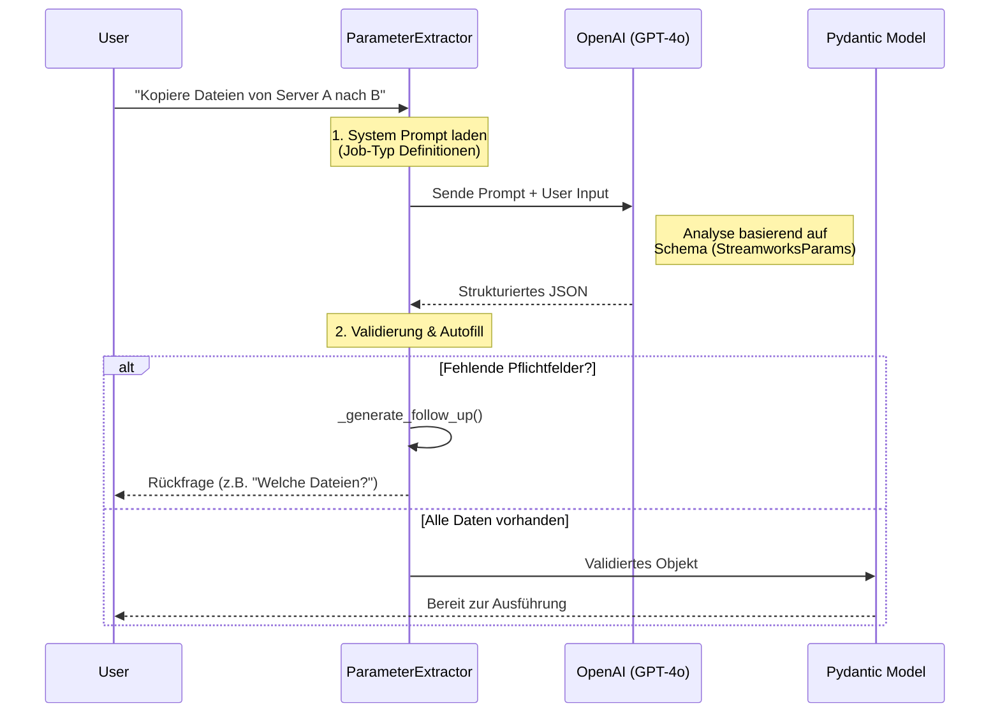
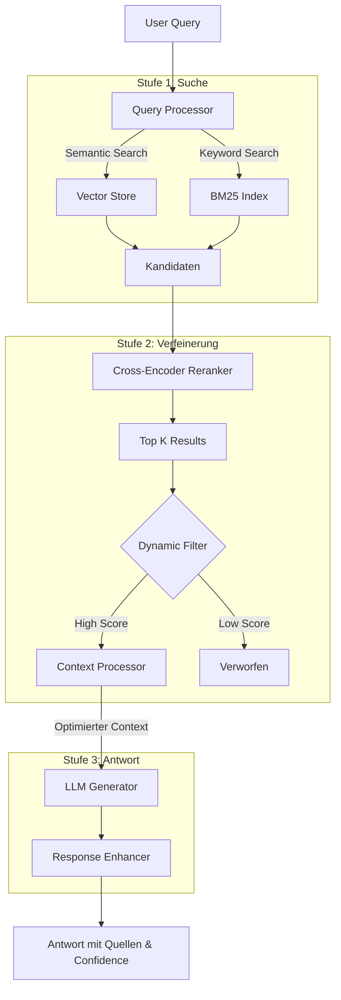

# AI Agent: Systemarchitektur & Funktionsweise

Dieses Dokument erklärt die interne Logik des Streamworks KI-Agenten, speziell die Parameter-Extraktion und das RAG-System.

## 1. Parameter Extraktion (Structured Output)

Der Agent nutzt die `instructor` Bibliothek, um aus natürlicher Sprache präzise, strukturierte Daten (JSON) für die API-Steuerung zu gewinnen.

### Workflow

### Kern-Komponenten Code
*Datei: [parameter_extractor.py](file:///Applications/Programmieren/Visual Studio/Bachelorarbeit/Streamworks-KI/backend/services/ai/parameter_extractor.py)*

1.  **Job-Typ Erkennung**: Das System unterscheidet automatisch zwischen `FILE_TRANSFER`, `SAP`, und `STANDARD` Jobs basierend auf Keywords.
2.  **Validation Loop**: Es prüft, ob alle für den Job-Typ notwendigen Felder (z.B. `source_agent`, `target_agent`) vorhanden sind.
3.  **Fehlerkorrektur**: Generiert automatisch Rückfragen in natürlicher Sprache, wenn Informationen fehlen.

---

## 2. Enhanced RAG Pipeline (Retrieval Augmented Generation)

Das RAG-System nutzt eine mehrstufige Pipeline (Hybrid Search + Reranking), um qualitativ hochwertige Antworten aus der Dokumentation zu generieren.

### Pipeline Architektur

### Detaillierte Schritte
*Datei: [enhanced_rag_chat_service.py](file:///Applications/Programmieren/Visual Studio/Bachelorarbeit/Streamworks-KI/backend/services/rag/enhanced_rag_chat_service.py)*

1.  **Query Processing**: Die Anfrage wird analysiert (optional via HyDE erweitert), um bessere Suchbegriffe zu generieren.
2.  **Hybrid Search**: Kombiniert Vektorsuche (Verständnis) und Stichwortsuche (Präzision).
3.  **Reranking**: Ein spezialisiertes Modell bewertet die Relevanz der gefundenen Dokumente neu, um "Halluzinationen" zu reduzieren.
4.  **Dynamic Filtering**: Entfernt Ergebnisse, deren Score zu weit vom besten Treffer abweicht (Rauschunterdrückung).
5.  **Context Processing**: Komprimiert und dedupliziert Textabschnitte, um das Kontext-Fenster optimal zu nutzen.
6.  **Response Enhancement**: Fügt Zitate hinzu und berechnet einen Confidence-Score.
