# 🧠 Parameter Extraktion (Das "Gehirn")

## ⚡ Der Prozess

Wie aus *"Mach ein Backup auf Server X"* ein technisches Objekt wird.

```mermaid
sequenceDiagram
    participant User as 👤 User
    participant AI as 🤖 KI-Service
    participant Schema as 📋 Schema (Pydantic)
    participant Result as ✅ Ergebnis

    User->>AI: "Backup täglich um 08:00 auf srv01"
    Note over AI: 1. Prüfung mit Instructor
    AI->>Schema: Passt das in 'StreamworksParams'?
    
    rect rgb(20, 50, 20)
        Note right of Schema: Mapping:
        Schema-->>AI: schedule = "täglich"
        Schema-->>AI: start_time = "08:00"
        Schema-->>AI: agent_detail = "srv01"
    end
    
    AI->>Result: Erzeuge valides Python Objekt
    Result-->>User: Zeige Vorschau in UI
```

## 🛠️ Technologie-Stack

| Komponente | Aufgabe | Warum? |
|------------|---------|--------|
| **OpenAI GPT-4o** | Versteht Sprache | Beste Logik & Kontextverständnis |
| **Instructor** | Zwingt Struktur | Verhindert "Halluzinationen" (freies Erfinden) |
| **Pydantic** | Validiert Daten | Garantiert korrekte Typen (Zahlen, Datum, etc.) |

## ✨ Magie im Detail

Das System erkennt automatisch **fehlende Pflichtfelder**:

1. **User**: *"Kopiere Dateien."*
2. **KI checkt Schema**: `FILE_TRANSFER` erkannt.
   - ❌ `source_agent` fehlt.
   - ❌ `target_agent` fehlt.
3. **KI reagiert**: *"Von welchem Server und wohin soll kopiert werden?"*

> [!IMPORTANT]
> Es wird kein XML *generiert*, sondern ein **Konfigurationsobjekt**. 
> Erst ganz am Ende wird daraus XML gebaut. Das macht das System stabil.
