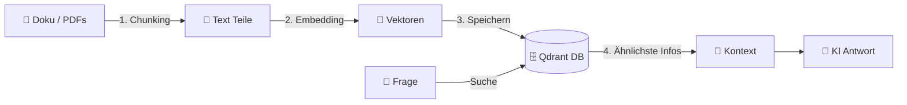

# 📚 RAG System (Das "Gedächtnis")

## 🔍 Retrieval Augmented Generation

Damit die KI nicht nur "allgemein schlau" ist, sondern **Arvato-Experte** wird.

## 💡 Wie es funktioniert

### 1. Ingestion (Lernen)
*   Wir füttern das System mit Handbüchern, Server-Listen und alten Projekten.
*   Alles wird in **Vektoren** (Zahlenreihen) verwandelt und gespeichert.

### 2. Retrieval (Erinnern)
*   User fragt: *"Wie ist die Naming Convention für SAP Jobs?"*
*   System sucht in Millisekunden die passenden Absätze in der Datenbank.

### 3. Generation (Antworten)
*   Die KI bekommt die Frage **PLUS** die gefundenen Absätze.
*   Antwort: *"Laut Dokument 'Guidelines 2024' müssen SAP Jobs mit 'SAP_' beginnen."*

## 🌟 Vorteile

*   **Kein Training nötig**: Dokument hochladen = Wissen sofort da.
*   **Datenschutz**: Die KI lernt nichts dauerhaft auswendig, sie "liest" nur kurz nach.
*   **Aktualität**: Dokument ändern -> Wissen aktualisiert.
